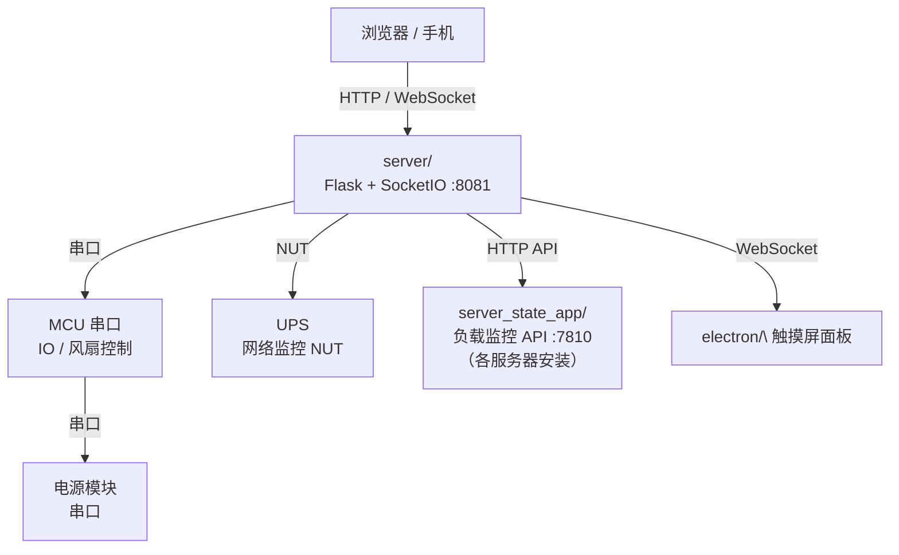

# Dream Machine

> 开源机柜及控制软件系统

Dream Machine 是一套完整的开源机柜项目，涵盖机柜结构设计、控制器硬件设计、嵌入式控制软件、Web 管理后端与本地触摸屏面板，集成 IO 控制、风扇管理、UPS 监控、环境安全保护与多服务器状态聚合。

本项目包含：

- **机柜设计** — 机柜结构 STEP 文件
- **控制器硬件设计** — 控制器 PCB 原理图与硬件资料
- **软件设计** — Flask 后端服务、串口通信、Web 管理界面 基于 Electron 的 ARM64 本地触摸屏面板
- **屏幕设计** —  使用成品屏幕制作面板 

## 序

项目本来想完全依赖 Electron 来构建，但随着开发深入，有些问题解决起来愈发困难，Electron 成了废案。但不想重构，就造成了 UI 为 Electron 大部分功能实现在 Python 上实现的现状。
---
## 关项目
* 机柜STEP等设计 ： 稍后完善
* 控制器PCB/屏幕面板 ： 稍后完善
* CSPS电源控制器： [CSPS_TO_USB_AND_WIFI](https://github.com/bilibilifmk/CSPS_TO_USB_AND_WIFI)

## 系统架构



---

## 子模块

| 目录 | 说明 | 文档 |
|------|------|------|
| `server/` | Flask + SocketIO 后端，提供 Web 界面、IO/风扇/UPS 控制、串口通信 | [server/README.md](server/README.md) |
| `electron/` | Electron 本地触摸屏面板，运行于 ARM64 设备 | [electron/README.md](electron/README.md) |
| `server_state_app/` | 轻量级 CPU 负载监控 API，供主控后端查询各服务器状态 | [server_state_app/README.md](server_state_app/README.md) |

---

## 功能概览

### IO 控制
- 7 路可命名 IO 输出（照明、交换机、硬盘、5V、POE、服务器电源等）
- 支持锁定保护、默认状态配置

### 风扇管理
- 4 路风扇独立转速控制（控制器风扇 / 进风 / 排风 / 内循环）
- 标准模式 / 全速模式定时切换
- 温度超限自动保护

### UPS 监控
- 网络 UPS（NUT）状态轮询
- 异常事件 Bark 推送通知

### 环境安全
- 温度超限告警与 IO 联动
- 滤芯寿命追踪与到期提醒

### 多服务器状态聚合
- 通过 `server_state_app` API 轮询各服务器 CPU 负载
- 网络连通性检测（LAN / WAN / 反向代理 / VPN）

### 本地触摸屏面板
- Electron 应用运行于 H618 ARM64 嵌入式 Linux
- 实时展示网络、环境、电源、服务器状态

---

## 快速开始

### 后端服务

```bash
cd server
uv run app.py
# 或使用 systemd：
sudo systemctl start Dream_Machine_server
```

默认监听 `0.0.0.0:8081`，首次访问使用默认账号 `root / password` 登录。

### 本地面板

```bash
cd electron
npm install
npm start
# 或使用 systemd（ARM64 Linux）：
sudo systemctl start Dream_Machine_app
```

### 负载监控 API

```bash
cd server_state_app
python3 server_state_app.py
# 或使用 systemd：
sudo systemctl start Dream_Machine_state_app
```

---

## 部署

各子模块均提供 systemd 服务单元文件，建议安装路径为 `/opt/Dream_Machine/`：

```bash
# 服务器后端
sudo cp server/Dream_Machine_server.service /etc/systemd/system/

# 本地面板（ARM64 设备）
sudo cp electron/Dream_Machine_app.service /etc/systemd/system/

# 负载监控 API（各被监控服务器）
sudo cp server_state_app/Dream_Machine_state_app.service /etc/systemd/system/

sudo systemctl daemon-reload
sudo systemctl enable Dream_Machine_server Dream_Machine_app Dream_Machine_state_app
sudo systemctl start  Dream_Machine_server Dream_Machine_app Dream_Machine_state_app
```

---

## 配置

系统配置统一写在 `server/configuration.cfg`，支持通过 Web 界面在线编辑。主要配置项：

| Section | 说明 |
|---------|------|
| `[SYS]` | 串口设备路径、风扇模式、滤芯寿命 |
| `[ENV_SAFETY]` | 温度限值、IO 联动策略 |
| `[NETWORK]` | 网卡名称、各网络检测目标 |
| `[UPS]` | NUT 主机地址 |
| `[BARK]` | 推送通知配置 |
| `[SERVER_LIST]` | 被监控服务器列表 |
| `[IO0]~[IO6]` | 各路 IO 名称与默认状态 |
| `[FAN0]~[FAN3]` | 风扇命名 |
| `[FAN_MOD*]` | 风扇转速模式预设 |

---

## 项目结构

```
Dream_Machine/
├── server/                   # 后端服务
│   ├── app.py                # 主入口
│   ├── config.py             # 配置读写
│   ├── configuration.cfg     # 系统配置
│   ├── mcu_serial.py         # MCU 串口通信
│   ├── power_serial.py       # 电源串口通信
│   ├── ups_monitor.py        # UPS 监控
│   ├── bark_notify.py        # Bark 推送
│   ├── log.py                # 日志模块
│   ├── debug_mode.py         # 调试模式
│   ├── Dream_Machine_server.service
│   └── static/               # 前端静态资源
│
├── electron/                 # 本地触摸屏面板
│   ├── index.js              # Electron 主进程
│   ├── index.html            # 窗口入口
│   ├── index/                # 面板前端
│   ├── Dream_Machine_app.service
│   └── package.json
│
├── server_state_app/         # 负载监控 API
│   ├── server_state_app.py
│   └── Dream_Machine_state_app.service
│
└── .gitignore
```

---

## License

MIT
